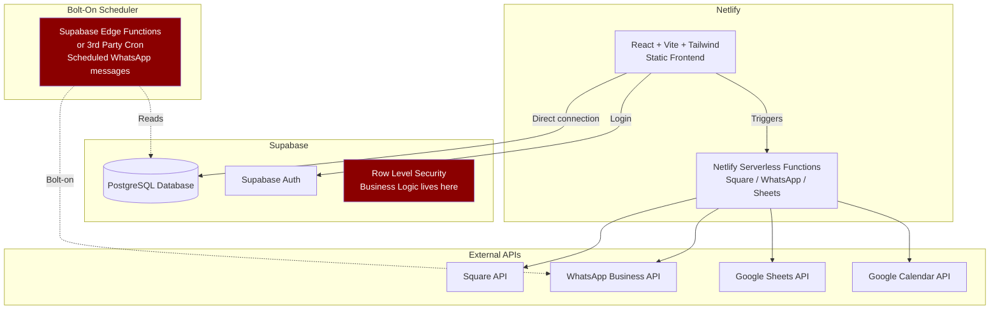
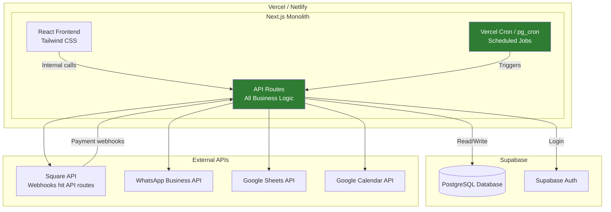
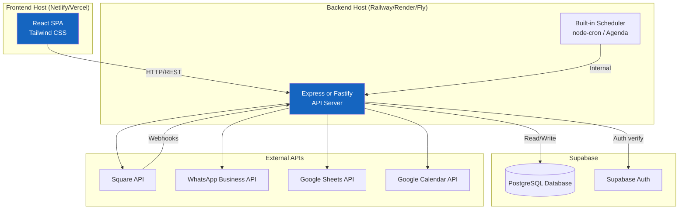
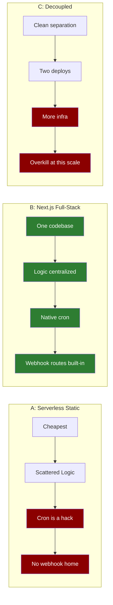
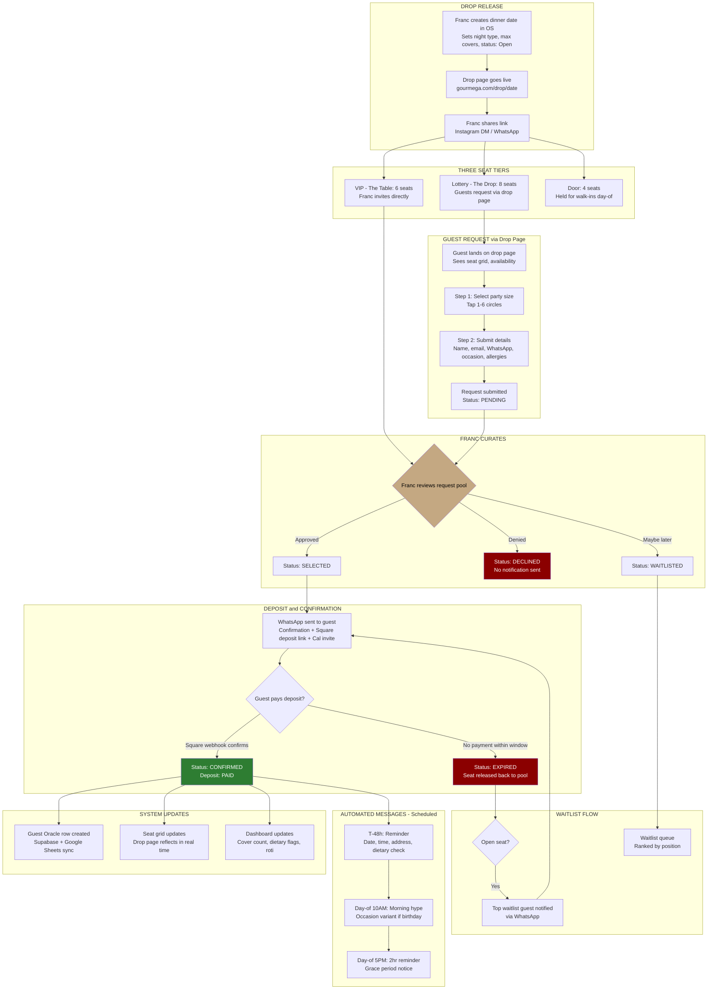
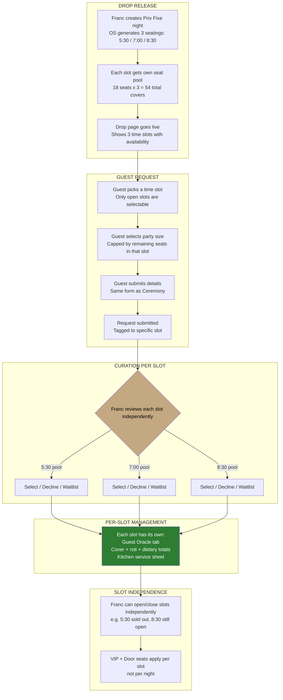

# Gourmega Architecture Paths

## Approach A: Serverless Static

## Approach B: Lightweight Backend (Recommended)

## Approach C: Decoupled Services

## Side-by-Side Comparison

## Booking Flow: Ceremony Night (Single Seating)

## Booking Flow: Prix Fixe Night (Three Seatings)

## Guest Lifecycle: End to End

```mermaid
flowchart LR
    subgraph "DISCOVERY"
        A[Franc shares drop link<br/>IG DM or WhatsApp]
    end

    subgraph "REQUEST"
        B[Guest lands on drop page]
        C[Submits seat request]
    end

    subgraph "CURATION"
        D[Franc reviews]
        E{Decision}
    end

    subgraph "PAYMENT"
        F[WhatsApp: deposit link sent]
        G[Guest pays via Square]
        H[Webhook confirms payment]
    end

    subgraph "PRE-DINNER"
        I[T-48h reminder]
        J[Day-of morning hype]
        K[Day-of 2hr reminder]
    end

    subgraph "DINNER"
        L[Guest arrives<br/>Oracle used by kitchen]
    end

    A --> B --> C --> D --> E
    E -->|Selected| F --> G --> H
    E -->|Waitlisted| W[Waitlist queue]
    E -->|Declined| X[Silent - no notification]
    H --> I --> J --> K --> L
    W -.->|Spot opens| F

    style E fill:#C4A882,color:#000
    style H fill:#2E7D32,color:#fff
    style X fill:#8B0000,color:#fff
```

